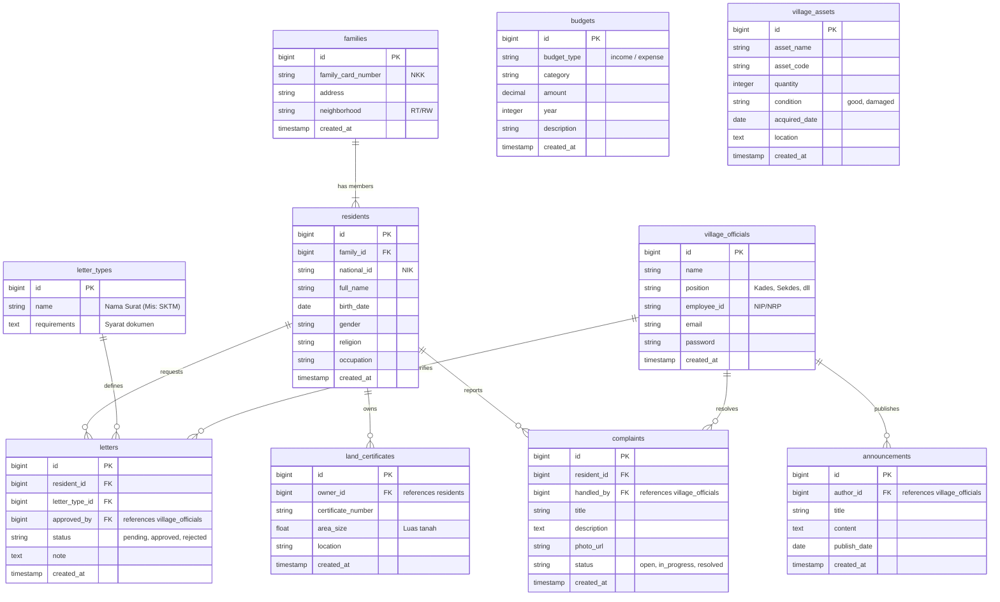

# Product Requirements Document (PRD) - Sistem Administrasi Desa (Sidesa)

## 1. Ringkasan Eksekutif (Executive Summary)
Sistem Administrasi Desa (Sidesa) adalah platform digital terintegrasi yang dirancang untuk mendigitalkan pelayanan publik dan administrasi tingkat desa/kelurahan. Sistem ini bertujuan untuk mempermudah warga dalam mengurus dokumen, meningkatkan transparansi anggaran, serta membantu perangkat desa dalam mengelola aset, data kependudukan, dan pengaduan masyarakat secara efisien.

## 2. Target Pengguna (User Personas)
1. **Warga (Citizens)**
   - **Kebutuhan**: Mengajukan surat pengantar secara online, melihat pengumuman desa, melaporkan keluhan, dan melihat ringkasan transparansi anggaran.
2. **Perangkat Desa (Village Officials / Admin)**
   - **Kebutuhan**: Memverifikasi pengajuan surat, mengelola data penduduk dan Kartu Keluarga, mengelola aset desa, memperbarui anggaran, dan menangani pengaduan warga.
3. **Kepala Desa (Village Head)**
   - **Kebutuhan**: Memantau dashboard keseluruhan (statistik penduduk, keluhan, anggaran), memberikan *approval* akhir untuk dokumen tertentu, dan mempublikasikan pengumuman.

## 3. Ruang Lingkup Fitur (Feature Scope)
1. **Manajemen Data Penduduk & Kartu Keluarga**
   - CRUD data Kartu Keluarga (KK).
   - CRUD data Penduduk (NIK, Nama, TTL, Pekerjaan, dll) yang berafiliasi dengan KK tertentu.
2. **Pengurusan Surat Menyurat Online**
   - Warga dapat *request* pembuatan surat (misal: SKTM, Surat Pengantar Nikah, Surat Pindah).
   - *Tracking* status surat (Menunggu, Diproses, Selesai, Ditolak).
3. **Manajemen Sertifikat Tanah**
   - Pencatatan buku persil/sertifikat tanah yang ada di wilayah desa beserta kepemilikannya.
4. **Portal Pengaduan Warga**
   - Warga dapat mengirimkan laporan/keluhan beserta foto bukti.
   - Perangkat desa dapat menindaklanjuti dan mengubah status keluhan.
5. **Manajemen Anggaran Desa (Transparansi)**
   - Pencatatan Rencana Anggaran Pendapatan dan Belanja Desa (RAPBDes).
   - Laporan realisasi anggaran agar dapat diakses warga secara transparan.
6. **Inventaris Aset Desa**
   - Pencatatan barang dan aset milik desa (tanah kas desa, kendaraan operasional, peralatan kantor).
7. **Pengumuman Desa**
   - Mading digital untuk informasi kegiatan, penyuluhan, atau berita penting dari Balai Desa.

---

## 4. Skema Data & Arsitektur

### 4.1 Penjelasan Naratif
Arsitektur basis data relasional dirancang menggunakan 10 tabel utama untuk mendukung seluruh fitur di atas:

1. **`families` (Kartu Keluarga)**: Menyimpan Nomor Kartu Keluarga (NKK) dan alamat rumah. Ini merupakan tabel *parent* bagi penduduk.
2. **`residents` (Penduduk)**: Menyimpan NIK, Nama, dan demografi individu. Memiliki relasi *Many-to-One* ke tabel `families`. Warga yang menggunakan sistem akan di-mapping dari tabel ini.
3. **`village_officials` (Perangkat Desa)**: Menyimpan data aparatur desa (termasuk Kepala Desa) lengkap dengan jabatannya. Berguna untuk *tracking* siapa yang memverifikasi surat atau menindaklanjuti keluhan.
4. **`letter_types` (Jenis Surat)**: Master data untuk macam-macam surat yang disediakan oleh desa (misal: Keterangan Domisili).
5. **`letters` (Surat/Pengajuan)**: Transaksi pengajuan surat oleh warga. Memiliki relasi ke `residents` (pemohon), `letter_types` (jenis surat), dan `village_officials` (yang memverifikasi).
6. **`land_certificates` (Sertifikat Tanah)**: Menyimpan data kepemilikan tanah/persil di wilayah desa. Berelasi dengan `residents` sebagai pemilik sah.
7. **`complaints` (Pengaduan)**: Laporan warga. Memiliki relasi ke `residents` (pelapor) dan dapat ditindaklanjuti oleh `village_officials`.
8. **`announcements` (Pengumuman)**: Berita atau informasi dari desa. Berelasi ke `village_officials` sebagai *author* atau pembuat pengumuman.
9. **`budgets` (Anggaran)**: Menyimpan item anggaran desa, baik itu pemasukan maupun pengeluaran, lengkap dengan nominal dan tahun anggarannya.
10. **`village_assets` (Aset Desa)**: Data pencatatan inventaris barang milik desa (kondisi, nilai aset, tanggal perolehan).

### 4.2 Entity Relationship Diagram (ERD)

---
*Dokumen ini merupakan panduan spesifikasi dan akan digunakan sebagai acuan pengembangan teknis sistem.*
